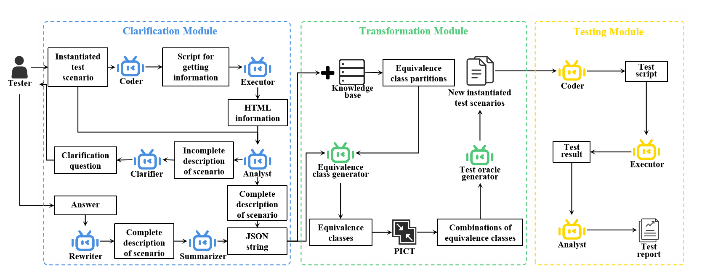

# WebMAC: A Multi-Agent Collaborative Framework for Scenario Testing of Web Systems

## Introduce



WebMAC is a multi-agent collaborative framework for scenario testing of web systems. WebMAC can complete natural language descriptions of test scenarios, generate adequate instantiated test scenarios, and convert them into corresponding test scripts.

## Model introduce

### 1. Clarification module (clarify.py)

#### Description
The Clarification module is responsible for clarifying and refining the description of test scenarios. It employs multi-agent collaboration (including agents such as Coordinator, Coder, Executor, Analyst, Clarify, and Rewriter) to analyze and improve the given test scenarios, making them more precise and executable.

#### Input
- `base_model`: The name of the LLM model used
- `execution_config`: Execution configuration dictionary
- `summary_method`: Summary method
- `max_round`: Maximum number of conversation rounds
- Test scenario description string

#### Usage
```python
from clarify import Clarify

clarifier = Clarify()
```

### 2. Transformation module (metamorphosis.py)

#### Description
The Transformation model module is used to generate variants of test cases. It creates valid and invalid test scenario variants through equivalence class analysis and LLM assistance, helping to discover more potential errors.

#### Input
- `scenario`: Test scenario string
- `variable`: List of variables in the scenario
- `equivalence_class`: Dictionary of equivalent classes for the variables
- CSV file path (including test data)

#### Usage
```python
from metamorphosis import metamorphosis_var, replace_var_to_template

mutated_vars = metamorphosis_var(scenario, variables, equivalence_classes)

test_cases = replace_var_to_template(csv_file, true_template, false_template, valid_dict)
```

### 3. Testing module (test.py)

#### Description
Testing module负责执行测试用例。它使用Coder、Executor和Analyst三个代理来编写测试代码、执行测试并分析结果。

#### Input
- `base_model`: 使用的LLM模型名称（默认 "gpt-3.5-turbo-0125"）
- `execution_config`: 执行配置字典（可选）
- `summary_method`: 摘要方法（默认 "reflection_with_llm"）
- `max_round`: 最大对话轮数（默认 50）
- 测试场景描述

#### Usage
```python
from test import Test

tester = Test()
```

## Project Structure

- `clarify.py`: Scene Clarification Module
- `metamorphosis.py`: Test Transformation Module
- `test.py`: Test Execution Module
- `main.py`: Main Entry Program
- `config_for_clarify.py`: Configuration File
- `browser.py`: Browser Operation Module
- `model/`: Code related to models
- `data/`: Data Files
- `Experiment_Runs/`: Experimental Run Results
- `knowledgebase/`: Knowledge Base Files

## Important Notes 

- Ensure that the OpenAI API key has been correctly set.
- Before running, the target web application (such as PetClinic, etc.) needs to be started.